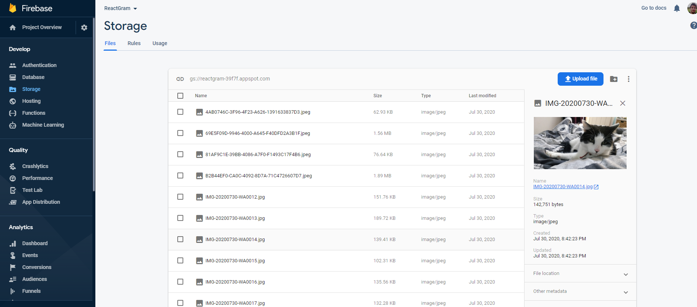

# KeikoGram
A fan site dedicated to my lazy cat.   A site using some nice features in React, with a database on Firebase and some Framer Motion effects.

# Demo

## Some handy Links and Tools I used with this

https://firebase.google.com/ - to keep the images in the back

https://reactjs.org/ - to have all the components do their thing

https://www.netlify.com/ - to deploy it up onto to the interwebs

https://www.framer.com/motion/ - to have some fluid animations on the loading and lightbox

### `npm start`

Runs the app in the development mode. 
Open [http://localhost:3000](http://localhost:3000) to view it in the browser when downloaded!.

